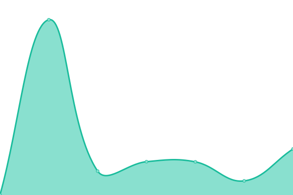
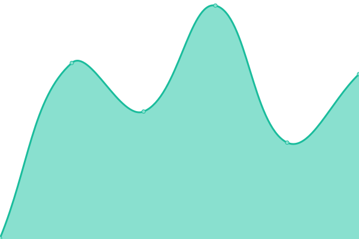
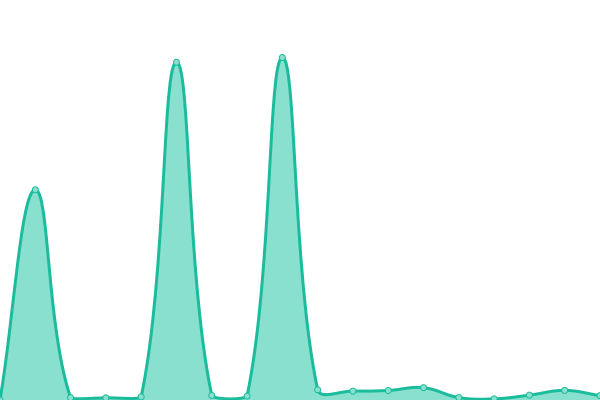
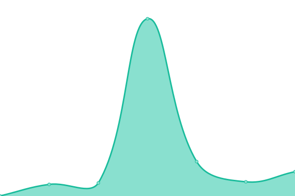
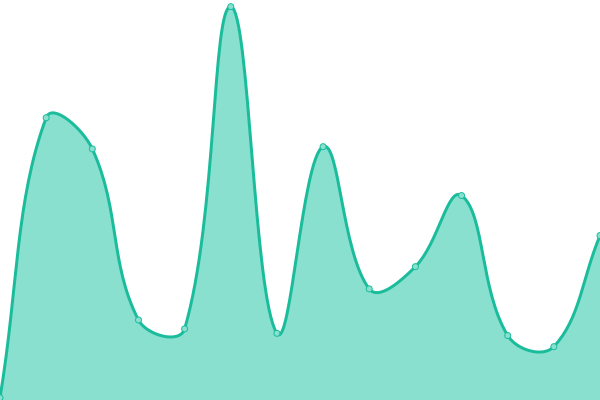

# [📈 Live Status](https://upptime.github.io/upptime): <!--live status--> **🟧 Partial outage**

This repository contains the open-source uptime monitor and status page for [Upptime](https://upptime.js.org), powered by [Upptime](https://github.com/upptime/upptime).

With [Upptime](https://upptime.js.org), you can get your own unlimited and free uptime monitor and status page, powered entirely by a GitHub repository. We use [Issues](https://github.com/upptime/upptime/issues) as incident reports, [Actions](https://github.com/glo-markoaular/status-navigate/actions) as uptime monitors, and [Pages](https://upptime.github.io/upptime) for the status page.

<!--start: status pages-->
<!-- This summary is generated by Upptime (https://github.com/upptime/upptime) -->
<!-- Do not edit this manually, your changes will be overwritten -->
<!-- prettier-ignore -->
| URL | Status | History | Response Time | Uptime |
| --- | ------ | ------- | ------------- | ------ |
|  Navigate | 🟥 Down | [navigate.yml](https://github.com/glo-markoaular/status-navigate/commits/HEAD/history/navigate.yml) | 

 0ms
     
 | 

<a href="https://glo-markoaular.github.io/status-navigate/history/navigate">0.00%</a>
    

|  Rancher | 🟥 Down | [rancher.yml](https://github.com/glo-markoaular/status-navigate/commits/HEAD/history/rancher.yml) | 

 0ms
     
 | 

<a href="https://glo-markoaular.github.io/status-navigate/history/rancher">0.00%</a>
    

|  Redmine | 🟥 Down | [redmine.yml](https://github.com/glo-markoaular/status-navigate/commits/HEAD/history/redmine.yml) | 

 768ms
     
 | 

<a href="https://glo-markoaular.github.io/status-navigate/history/redmine">29.12%</a>
    

|  CMS | 🟩 Up | [cms.yml](https://github.com/glo-markoaular/status-navigate/commits/HEAD/history/cms.yml) | 

 1228ms
     
 | 

<a href="https://glo-markoaular.github.io/status-navigate/history/cms">99.02%</a>
    

|  APP | 🟩 Up | [app.yml](https://github.com/glo-markoaular/status-navigate/commits/HEAD/history/app.yml) | 

 1156ms
     
 | 

<a href="https://glo-markoaular.github.io/status-navigate/history/app">99.20%</a>
    

|  INTG-APP | 🟥 Down | [intg-app.yml](https://github.com/glo-markoaular/status-navigate/commits/HEAD/history/intg-app.yml) | 

 143ms
     
 | 

<a href="https://glo-markoaular.github.io/status-navigate/history/intg-app">15.36%</a>
    

<!--end: status pages-->

[**Visit our status website →**](https://upptime.github.io/upptime)

## 📄 License

- Powered by: [Upptime](https://github.com/upptime/upptime)
- Code: [MIT](./LICENSE) © [Upptime](https://upptime.js.org)
- Data in the `./history` directory: [Open Database License](https://opendatacommons.org/licenses/odbl/1-0/)
